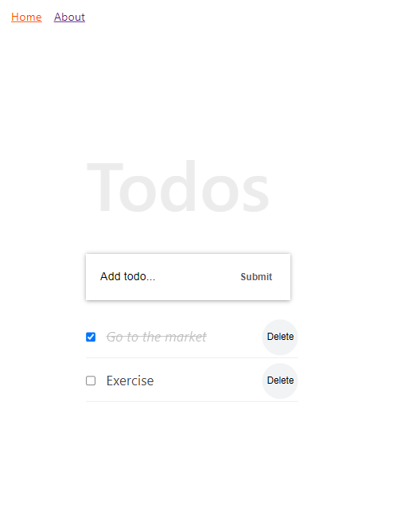

# React Todo App

> "To do app" Created by following the tutorial: React Tutorial From Scratch: A Step-by-Step Guide (2021).

## Built With

- React
- CSS3

## Getting Started

To get a local copy up and running follow these simple example steps.

### Setup and Install

- Clone this repository using the link above (click on the 'code' button)
- Open a terminal and `cd` to the cloned repository
- run `npm install`
- run `npm run start` to open a live server in your preferred browser.
 

## Author

👤  **Rocio Martinez** 
- Github: [@Rocio01](https://github.com/Rocio01) 
- Twitter: [@rugiada8801](https://twitter.com/rugiada8801) 
- Linkedin: [zulma-rocio-martinez](https://www.linkedin.com/in/zulma-rocio-martinez) 

## 🤝 Contributing

Contributions, issues, and feature requests are welcome!

Feel free to check the [issues page](https://github.com/Rocio01/react-todo-app/issues).

## Show your support

Give a ⭐️ if you like this project!

## Acknowledgments

-  [React Tutorial From Scratch](https://ibaslogic.com/react-tutorial-for-beginners/)
- Microverse

## 📝 License

This project is [MIT](LICENSE) licensed.